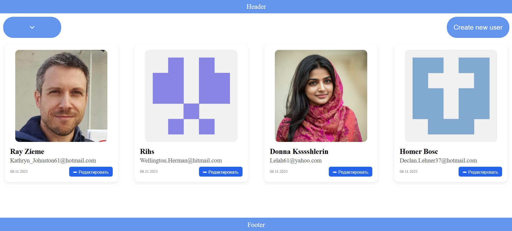
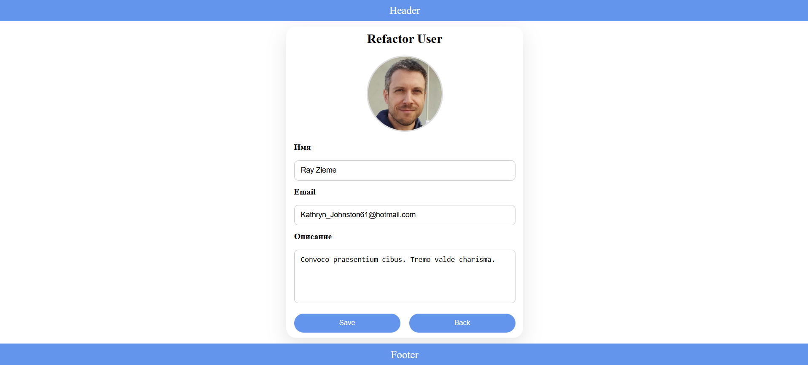

PeopleApp — это современное веб-приложение для управления списком людей, выполненное на базе React + TypeScript и организованное по архитектуре FSD (Feature-Sliced Design).
Проект демонстрирует грамотное разделение логики, масштабируемость и удобство развития кода.

Приложение позволяет добавлять, редактировать и удалять людей, а также хранить данные между сессиями благодаря Redux Toolkit и Redux-Persist, что делает работу стабильной и предсказуемой.

Стилизация выполнена через SCSS, что обеспечивает гибкость, модульность и чистоту стилей.

Что позволяет PeopleApp:

📌 Вести список людей в структурированном виде

✏️ Добавлять, редактировать и удалять записи

🔍 Быстро искать нужного человека

📱 Работать на любом устройстве благодаря адаптивному интерфейсу

⚡ Работать быстро и плавно — благодаря React + Vite

🧹 Поддерживать чистую структуру проекта благодаря TypeScript

Ключевые особенности

FSD-архитектура — удобное и масштабируемое разделение проекта на feature-модули

Redux Toolkit — управление состоянием по современным best-practices

Redux-Persist — надёжное сохранение данных в localStorage, даже при перезагрузке страницы

SCSS-стили — модульная и структурированная стилизация интерфейса

TypeScript — строгость типов и предсказуемость поведения

Vite — сверхбыстрая сборка и запуск проекта

### 👉 Главная страница
Интерфейс отображает пользователей в виде карточек с аватаром, именем, email и датой создания.  
Также доступно быстрое редактирование.

## 🔍 Функционал интерфейса

- ✅ Элегантные карточки пользователей  
- ✅ Поддержка реальных аватаров и авто-генерируемых аватаров  
- ✅ Кнопка создания нового пользователя  
- ✅ Удобная кнопка редактирования прямо на карточке  
- ✅ Адаптивный интерфейс — корректно отображается на любых устройствах  
- ✅ Структурированный Header и Footer  

### 👉 Страница реадтирования 



## 🔍 Функционал интерфейса
- ✅ Изменение имени и фамилии  
- ✅ Редактирование email  
- ✅ Загрузка или обновление аватара  
- ✅ Автоматическая валидация данных  
- ✅ Кнопка сохранения с мгновенным обновлением UI  

## 🚀 Установка и запуск
```bash
# Клонируем репозиторий
git clone https://github.com/LewFdtnkv/PeopleApp.git

# Переходим в папку проекта
cd PeopleApp

# Устанавливаем зависимости
npm install

# Запускаем проект
npm run dev
```